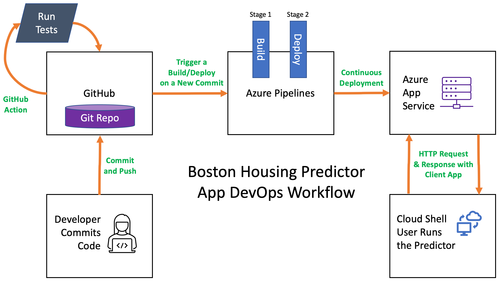
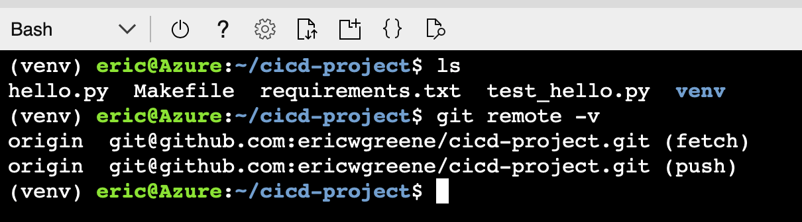
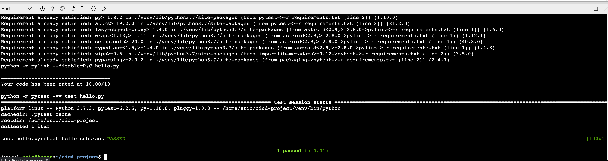
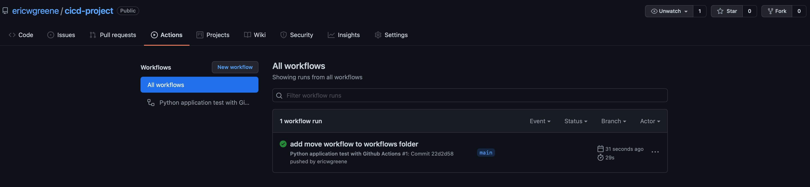
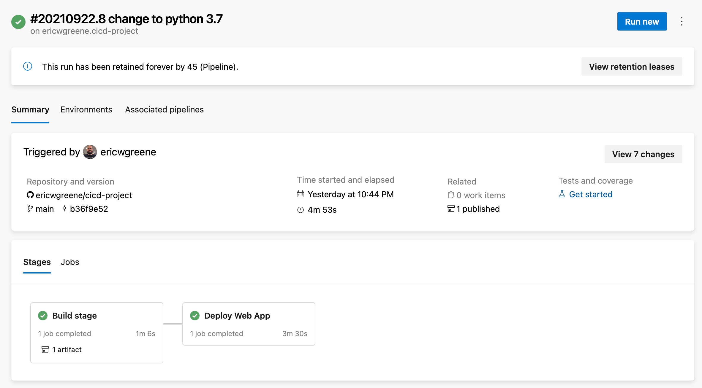
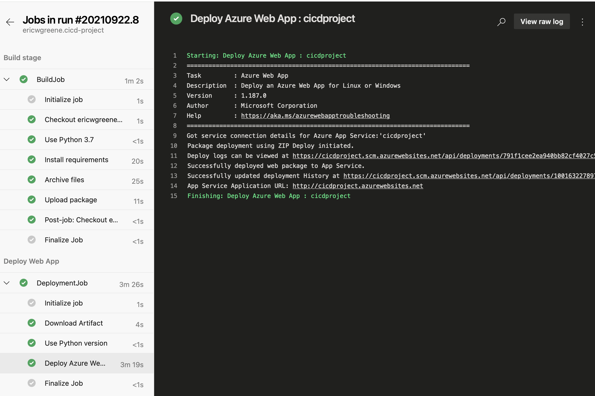
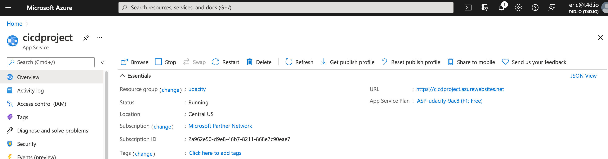
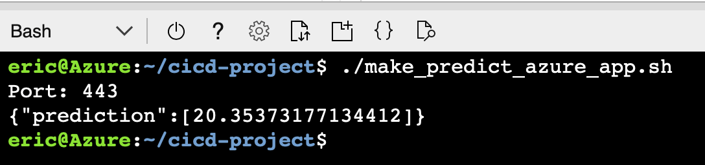
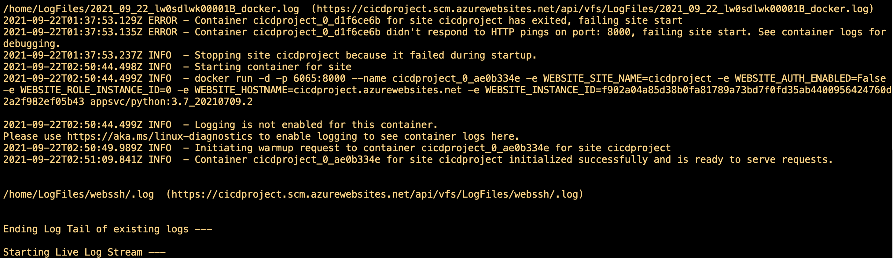

# Overview

The goal of the project is to demonstrate the principles of project manager, continuous development, continuous delivery and continuous deployment using modern development tools. To implement project management, Google Sheets and Trello are used. To implement CI/CD and Continuous Deployment, GitHub, Azure Pipelines, and Azure were used.

## Project Plan

Below are links to the Trello Board and Google Sheets Plan for the project.

* A link to a Trello board for the project: [Trello Board](https://trello.com/invite/b/etbnUf31/b86a08131718cbb6a897d8c9e64812fb/udacity-cicd-project)

* A link to a spreadsheet that includes the original and final project plan [Google Sheet](https://docs.google.com/spreadsheets/d/1J4IJ6MtrwWjDxFMhZ4iPvKVqBqMQsCUKJnpsnHzpDKc/edit?usp=sharing)

## Instructions

The following are instructions to perform a code change, deployment and execution of the predictor app. Below is diagram that describes the overall process and architecture.



1. Clone the repository, `https://github.com/ericwgreene/cicd-project.git`, into your cloud shell environment.

```bash
git clone https://github.com/ericwgreene/cicd-project.git
```



2. Change into the `cicd-project` folder (or whatever folder name you cloned it into).

```bash
cd cicd-project
```

3. Create and activate a Python 3 virtual environment.

```bash
python3.7 -m venv venv

source ./venv/bin/activate
```

4. Perform package updates and installs.

```bash
python -m pip install --upgrade pip

python -m pip install -r ./requirements.txt
```

5. Using an editor, Vi or Nano, make your desired changes.

6. After making your changes, verify that all tests pass. There are no tests for the Boston Housing code, but this step was part of the scaffolding project, and would normally be a part of a real application.

```bash
make all
```



7. Commit and push your code to GitHub.

```bash
git add -A

git commit -m "short description of changes"

git push
```

8. As part of the scaffolding project a GitHub action was configured to run the tests when new code was pushed. The final project did not require this, but here is a screenshot of it.



9. Azure Pipelines is configured to run on new commits to the GitHub repository, so the Azure Deployment Pipeline should kick off automatically.



10. Once Azure Pipeline builds the deployment package, it will deploy to the Azure App Service.



Here is a screenshot of the running App Service.



11. With the deployment complete, the `make_predict_azure_app.sh` can be executed in the cloud shell to make a prediction.

```bash
udacity@Azure:~$ ./make_predict_azure_app.sh
Port: 443
{"prediction":[20.35373177134412]}
```



12. To view the logs of the App Service, run the following command from the cloud shell.

```bash
az webapp log tail
```

The output should look similar to this.



## Enhancements

The project could be enhanced to consolidate the CI/CD process to just GitHub Actions or Azure Pipelies. The project code demonstrated running unit tests with GitHub Actions and doing the deployment with Azure Pipelines. Azure Pipelines and GitHub Actions solve the same problem. Either technology could be used to implement both the testing and the deployment.

The project could be enhanced to deploy a Docker Image to a Kubernetes cluster instead of a single App Service. Such an improvement would improve the scalability and resiliency of the application.

Finally, GitHub, Trello and the Google Sheet could be replaced with Azure DevOps. Generally, I prefer Azure Boards to Trello. I could use the hierarchical nature of Azure Boards to create Epics to manage much of the information in the spreadsheet. And finally, Azure Repos could be used in place of GitHub. This could enable tighter integration between the task management system and commits.

## Demo 

YouTube Video: [https://youtu.be/qrrIS15vM0k](https://youtu.be/qrrIS15vM0k)


